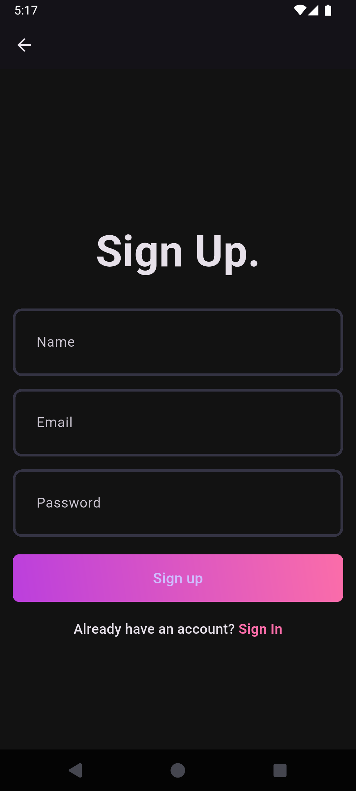
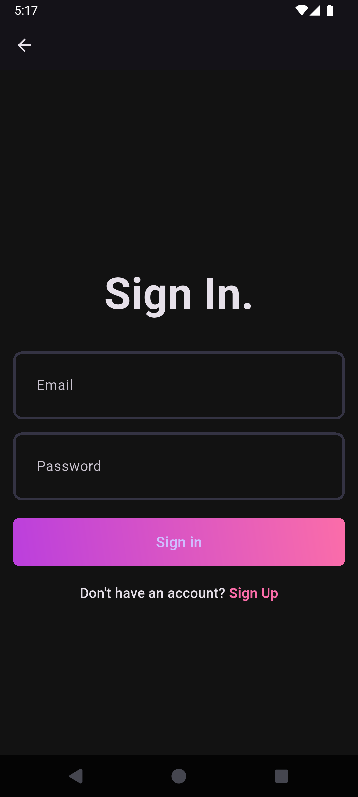
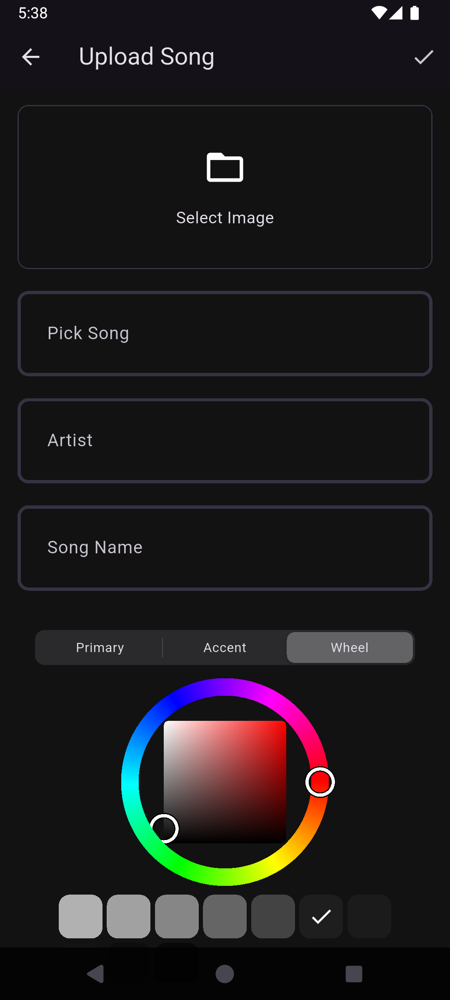
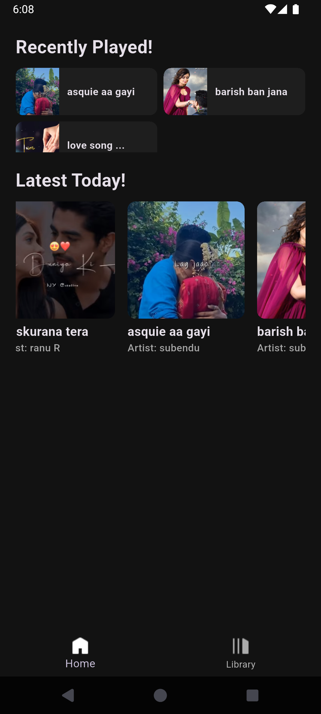
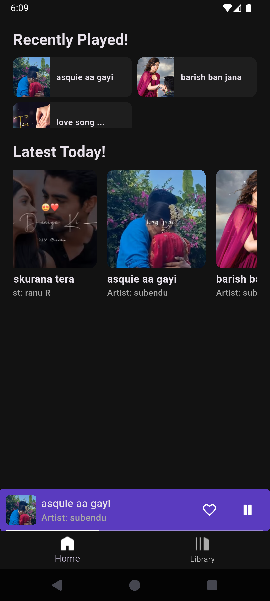
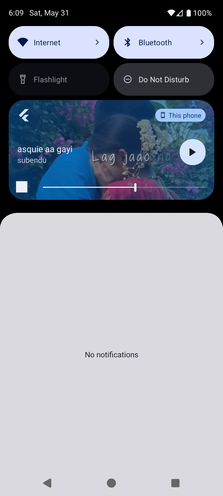
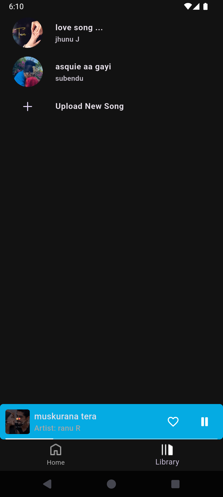

# 🎵 Flutter Music App

A beautiful and feature-rich music streaming application built with Flutter, following the MVVM (Model-View-ViewModel) architecture pattern. The app provides seamless music playback, user authentication, and favorite songs management with a modern, intuitive interface.

## 📱 Demo Screenshots

<div align="center">
  
  
  
  
  
  
  
  
</div>

## ✨ Features

### 🎧 Core Music Features

- **Background Music Playback** - Continuous music streaming even when app is minimized
- **Song Management** - Upload, browse, and organize your music library
- **Favorites System** - Add/remove songs to your personal favorites collection
- **Audio Controls** - Play, pause, skip, shuffle, and repeat functionality
- **Progress Tracking** - Real-time playback progress with seek controls

### 🔐 User Management

- **User Authentication** - Secure signup and login system
- **Session Management** - Persistent login with JWT token authentication

### 🎨 User Experience

- **Modern UI/UX** - Clean, intuitive interface with smooth animations
- **Responsive Design** - Optimized for various screen sizes
- **Push Notifications** - Background playback notifications

## 🏗️ Architecture

This application follows the **MVVM (Model-View-ViewModel)** architecture pattern, ensuring clean code separation and maintainability.

```
lib/
├── core/
│   ├── constants/
│   ├── failure/
│   ├── providers/
│   ├── theme/
│   ├── widgets/
│   └── utils.dart
├── features/
│   ├── auth/
│   │   ├── model/
│   │   ├── view/
│   │   │   ├── pages/
│   │   │   ├── widgets/
│   │   ├── repositories/
│   │   ├── view_model/
│   ├── home/
│   │   ├── model/
│   │   ├── view/
│   │   │   ├── pages/
│   │   │   ├── widgets/
│   │   ├── repositories/
│   │   ├── view_model/
```

### Architecture Benefits

- **Separation of Concerns** - Clear division between UI, business logic, and data
- **Testability** - Easy unit testing of ViewModels and Services
- **Maintainability** - Modular code structure for easy updates
- **Scalability** - Simple to add new features and screens

## 🚀 Getting Started

### Prerequisites

- Flutter SDK (latest)
- Dart SDK (latest)
- Android Studio / VS Code
- iOS Simulator / Android Emulator

### Installation

1. **Clone the repository**

   ```bash
   git clone https://github.com/Subhendu-Kumar/music_app_client.git
   cd music_app_client
   ```

2. **Install dependencies**

   ```bash
   flutter pub get
   ```

3. **Configure API endpoint**

   ```dart
   // lib/core/constants/server_constant.dart
   class ServerConstant {
     static const String serverURL = 'https://your-api-endpoint.com';
   }
   ```

4. **Run the application**
   ```bash
   flutter run
   ```

## 📦 Dependencies

### Core Dependencies

```yaml
dependencies:
  flutter:
    sdk: flutter
  cupertino_icons: ^1.0.8
  file_picker: ^10.1.9
  http: ^1.4.0
  fpdart: ^1.1.1
  flutter_riverpod: ^2.5.1
  riverpod_annotation: ^2.3.5
  shared_preferences: ^2.5.3
  flex_color_picker: ^3.7.1
  audio_waveforms: ^1.3.0
  just_audio: ^0.10.3
  hive: ^4.0.0-dev.2
  isar_flutter_libs: ^4.0.0-dev.13
  path_provider: ^2.1.0
  just_audio_background: ^0.0.1-beta.17
```

### Development Dependencies

```yaml
dev_dependencies:
  flutter_test:
    sdk: flutter
  flutter_lints: ^5.0.0
  riverpod_generator: ^2.4.0
  build_runner: ^2.4.10
  riverpod_lint: ^2.3.10
  custom_lint: ^0.6.4
```

## 🔌 API Integration

The app integrates with a FastAPI backend providing the following endpoints:

### Authentication Endpoints

- `POST /auth/signup` - User registration
- `POST /auth/login` - User authentication
- `GET /auth/user` - Get user profile

### Music Endpoints

- `POST /song/upload` - Upload new songs
- `GET /song/list` - Retrieve all songs
- `GET /song/fav` - Get favorite songs
- `POST /song/fav` - Add song to favorites

## 🎵 Audio Service Implementation

### Background Audio Service

```dart
@riverpod
class CurrentSongNotifier extends _$CurrentSongNotifier {

  @override
  SongModel? build() {
    return null;
  }

  void updateSong(SongModel song) async {
    // controls update current song and back ground play
  }

  void playPause() {
    // controls play pause
  }

  void seek(double val) {
    // controls seek
  }
}
```

### Key Audio Features

- **Background Playback** - Music continues when app is backgrounded
- **Media Controls** - Lock screen and notification controls
- **Queue Management** - Play next/previous functionality
- **Shuffle & Repeat** - Advanced playback modes

## 🤝 Contributing

1. Fork the repository
2. Create your feature branch (`git checkout -b feature/AmazingFeature`)
3. Commit your changes (`git commit -m 'Add some AmazingFeature'`)
4. Push to the branch (`git push origin feature/AmazingFeature`)
5. Open a Pull Request

### Code Style Guidelines

- Follow Dart/Flutter style guide
- Use meaningful variable and function names
- Add comments for complex logic
- Write tests for new features

## 📄 License

This project is licensed under the MIT License - see the [LICENSE](LICENSE) file for details.

## 📞 Support

For support and questions:

- 📧 Email: subhendukumardutta330@gmail.com
- 🐛 Issues: [GitHub Issues](https://github.com/Subhendu-Kumar/music_app_client/issues)

---

<div align="center">
  <strong>Made with ❤️ and Flutter</strong>
</div>
